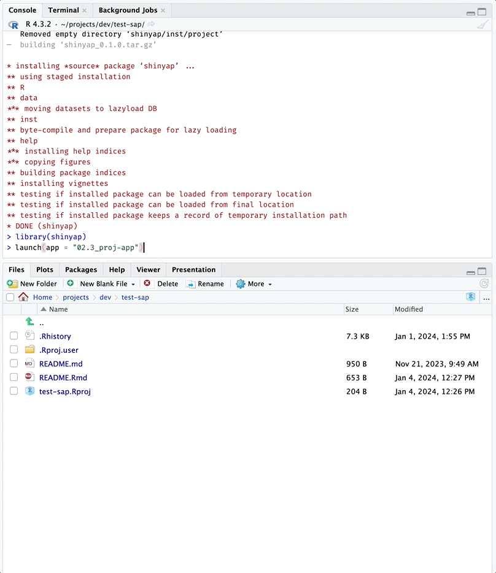

<!-- README.md is generated from README.Rmd. Please edit that file -->

```{r, include = FALSE}
knitr::opts_chunk$set(
  collapse = TRUE,
  comment = "#>",
  fig.path = "man/figures/",
  out.width = "100%"
)
```

# `shinyap`

<!-- badges: start -->
<!-- badges: end -->

The primary goal of `shinyap` is to provide easy access to the apps in the [Shiny App-Packages](https://mjfrigaard.github.io/shiny-app-pkgs/) book. `shinyap` also has functions for checking the files and folders in a Shiny app-package. 

## Installation

You can install the development version of `shinyap` from [GitHub](https://github.com/) with:

``` r
# install.packages("pak")
pak::pak("mjfrigaard/shinyap")
```

```{r}
library(shinyap)
```

## Git/GitHub configuration

`shinyap` uses the [`gert` package](https://docs.ropensci.org/gert/) for Git/GitHub management (and assumes authentication was done automatically using the `credentials` package).[^credentials]

[^credentials]: Check out the documentation for the [`credentials` package](https://docs.ropensci.org/credentials/articles/intro.html)


## Available app-packages

To see a list of the available app-packages in `shinyap`, use `list_apps()`[^all-apps]

[^all-apps]: Each of the apps in `shinyap` have a corresponding branch in the [moviesApp repo](https://github.com/mjfrigaard/moviesApp/branches/all).


```{r list_apps, eval=TRUE}
list_apps()
```

## Launch app (or app package)

Launch an application from any section in the book using:

```{r , eval=FALSE}
launch(app = "02.3_proj-app")
```

```{r launch, echo=FALSE, out.width='100%', fig.align='center'}

```


