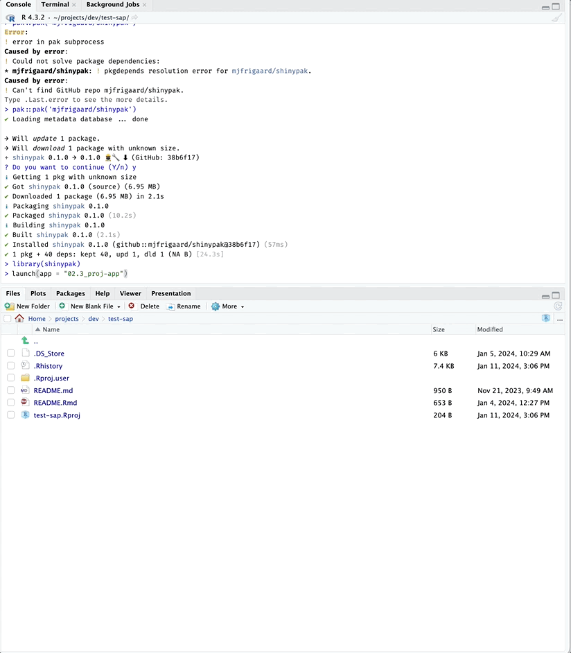

<!-- README.md is generated from README.Rmd. Please edit that file -->

# `shinyap`

<!-- badges: start -->
<!-- badges: end -->

The primary goal of `shinyap` is to provide easy access to the apps in
the [Shiny App-Packages](https://mjfrigaard.github.io/shiny-app-pkgs/)
book. `shinyap` also has functions for checking the files and folders in
a Shiny app-package.

## Installation

You can install the development version of `shinyap` from
[GitHub](https://github.com/) with:

``` r
# install.packages("pak")
pak::pak("mjfrigaard/shinyap")
```

``` r
library(shinyap)
```

## Git/GitHub configuration

`shinyap` uses the [`gert` package](https://docs.ropensci.org/gert/) for
Git/GitHub management (and assumes authentication was done automatically
using the `credentials` package).[^1]

## Available app-packages

To see a list of the available app-packages in `shinyap`, use
`list_apps()`[^2]

``` r
list_apps()
#>                 branch        last_updated
#> 1                 main 2023-11-22 00:17:49
#> 2    01_whole-app-game 2023-11-22 00:23:27
#> 3       02a_movies-app 2023-11-22 00:24:21
#> 4         02b_proj-app 2023-11-22 00:26:46
#> 5      03a_description 2023-12-06 14:28:52
#> 6            03b_rproj 2023-11-02 13:35:17
#> 7   03c_create-package 2023-11-02 13:35:34
#> 8          04_devtools 2023-11-02 13:35:52
#> 9          05_roxygen2 2023-11-17 15:53:36
#> 10     06a_pkg-exports 2023-11-17 15:54:17
#> 11     06b_pkg-imports 2023-11-17 15:54:52
#> 12             07_data 2023-12-08 20:15:19
#> 13       08_launch-app 2023-11-17 15:56:49
#> 14        09a_inst-www 2023-11-17 15:57:48
#> 15      09b_inst-bslib 2023-11-21 10:14:32
#> 16        09c_inst-dev 2023-11-17 15:59:04
#> 17       09d_inst-prod 2023-11-18 05:51:27
#> 18      11_tests-specs 2023-11-18 06:30:29
#> 19  12a_tests-fixtures 2023-11-18 06:31:06
#> 20   12b_tests-helpers 2023-11-18 06:31:53
#> 21     12f_tests-mocks 2023-11-18 06:34:25
#> 22 12g_tests-snapshots 2023-11-18 06:35:09
#> 23    13_tests-modules 2023-11-18 06:32:44
#> 24     14_tests-system 2023-11-21 10:08:21
#> 25            15_golem 2023-11-18 06:36:02
#> 26       16_leprechaun 2023-11-10 13:35:13
#> 27            17_rhino 2023-12-30 21:49:09
#> 28           18_docker 2023-11-21 10:08:21
#> 29       18a_debugging 2023-11-18 06:39:47
#> 30       18b_debugging 2023-11-18 06:40:34
#> 31       18c_debugging 2023-11-18 06:41:07
#> 32       18d_debugging 2023-11-18 06:41:46
#> 33       18e_debugging 2023-11-18 06:42:23
#> 34 19a_reactive-values 2023-11-18 06:44:24
#> 35       19b_user-data 2023-11-18 08:06:19
#> 36  20_tests-snapshots 2023-11-18 06:35:09
#> 37      21_tests-mocks 2023-11-18 06:34:25
#> 38    22a_trace-matrix 2023-11-18 08:26:20
#> 39                HEAD 2023-11-22 00:17:49
#> 40                main 2023-11-22 00:17:49
```

## Launch app (or app package)

Launch an application from any section in the book using:

``` r
launch(app = "02b_proj-app")
```



[^1]: Check out the documentation for the [`credentials`
    package](https://docs.ropensci.org/credentials/articles/intro.html)

[^2]: Each of the apps in `shinyap` have a corresponding branch in the
    [moviesApp
    repo](https://github.com/mjfrigaard/moviesApp/branches/all).
