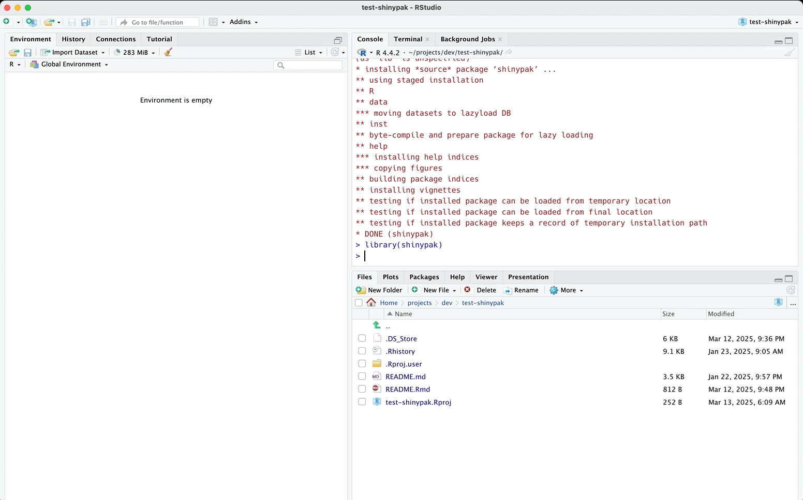

<!-- README.md is generated from README.Rmd. Please edit that file -->

# `shinypak`

<!-- badges: start -->
<!-- badges: end -->

The primary goal of `shinypak` is to provide easy access all the
application examples in
[`shinyAppPkgs`](https://github.com/mjfrigaard/shinyAppPkgs).[^1]

`shinypak` also has helper functions for checking the files and folders
in a Shiny app-package.

## Installation

You can install the development version of `shinypak` from
[GitHub](https://github.com/) after installing `remotes`:

``` r
install.packages('remotes')
remotes::install_github("mjfrigaard/shinypak")
```

``` r
library(shinypak)
```

## Git/GitHub configuration

`shinypak` uses the [`gert` package](https://docs.ropensci.org/gert/)
for Git/GitHub management (and assumes authentication was done
automatically using the `credentials` package).[^2]

## Available app-packages

The applications in `shinypak` are from the chapters of the [Shiny
App-Packages book](https://bit.ly/ShinyAppPkgs). A full list of the
available apps and topics are available in `topic_lookup`:

``` r
knitr::kable(
  head(topic_lookup, 10)
)
```

| branch              | part         | chapter        |
|:--------------------|:-------------|:---------------|
| 01_whole-app-game   | Intro        | Whole app game |
| 02.1_shiny-app      | Intro        | Shiny          |
| 02.2_movies-app     | Intro        | Shiny          |
| 02.3_proj-app       | Intro        | Shiny          |
| 03.1_description    | Intro        | Packages       |
| 03.2_rproj          | Intro        | Packages       |
| 03.3_create-package | Intro        | Packages       |
| 04_devtools         | Intro        | Development    |
| 05_roxygen2         | App-packages | Documentation  |
| 06.1_pkg-exports    | App-packages | Dependencies   |

``` r
knitr::kable(
  tail(topic_lookup, 10)
)
```

|     | branch              | part           | chapter                          |
|:----|:--------------------|:---------------|:---------------------------------|
| 44  | 26.1.1_step_01      | Special Topics | App Data                         |
| 45  | 26.1.2_step_02      | Special Topics | App Data                         |
| 46  | 26.1.3_step_03      | Special Topics | App Data                         |
| 47  | 26.1.4_step_04      | Special Topics | App Data                         |
| 48  | 26.2.0_user-data    | Special Topics | App Data                         |
| 49  | 26.2.1_step_01      | Special Topics | App Data                         |
| 50  | 26.2.2_step_02      | Special Topics | App Data                         |
| 51  | 27_stack-traces     | Special Topics | Stack traces                     |
| 52  | 28_dependency-hell  | Special Topics | Dependency hell                  |
| 53  | A.E_mocks-snapshots | Appendix       | Appendix E — Mocks and snapshots |

## Launching apps and app-packages

Launch an application from any section in the book using:

``` r
launch(app = "02.3_proj-app")
```



[^1]: Each of the apps in `shinypak` have a corresponding chapter in
    [Shiny App-Packages](https://mjfrigaard.github.io/shiny-app-pkgs/)
    and branch in the [shinyAppPkgs
    repo](https://github.com/mjfrigaard/shinyAppPkgs/branches/all).

[^2]: Check out the documentation for the [`credentials`
    package](https://docs.ropensci.org/credentials/articles/intro.html)
