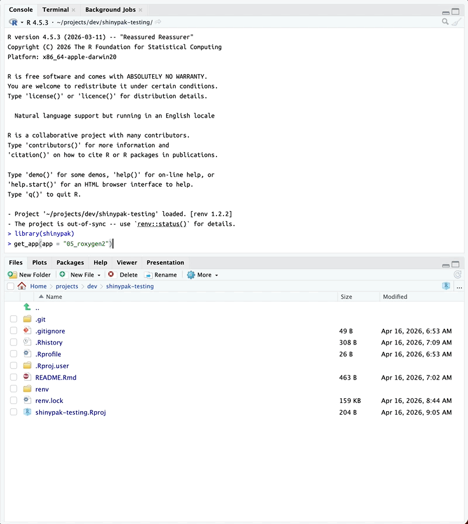
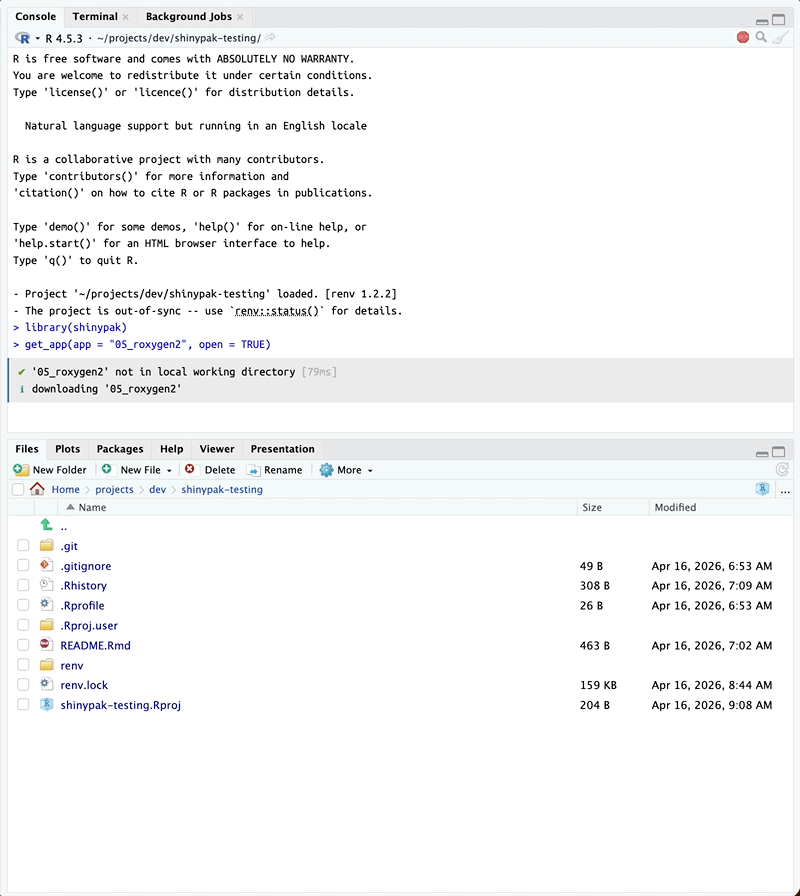

# shinypak

`shinypak` is a supplemental package for the [Shiny App-Packages
book](https://mjfrigaard.github.io/shiny-app-pkgs/). It’s functions are
designed to give readers of the book quick and easy access to the
app-packages so they can follow along.

## Authentication

`shinypak` assumes you have GitHub and RStudio (or Positron) synced.
Read more about setting this up on the [`gert` package
website](https://docs.ropensci.org/gert/#automatic-authentication)

> “*In `gert`, authentication is done automatically using the
> [`credentials`
> package](https://docs.ropensci.org/credentials/articles/intro.html).
> This package calls out to the local OS credential store which is also
> used by the git command line. Therefore `gert` will automatically pick
> up on https credentials that are safely stored in your OS keychain.*”

## Workflow

After authenticating with GitHub, a typical workflow with `shinypak`
would be:

1.  Install and load the package

``` r

install.packages('pak')
pak::pak("mjfrigaard/shinypak", force = TRUE)
```

``` r

library(shinypak)
```

2.  Find an example application in a chapter to follow along with (we’ll
    use `02.3_proj-app`).

3.  Find the application in the look-up table with
    [`list_apps()`](https://mjfrigaard.github.io/shinypak/reference/list_apps.md).
    You can specify a `regex` to return a table of branches matching a
    particular chapter or topic:

``` r

list_apps(regex = "^02.3") 
#>          branch        last_updated
#> 5 02.3_proj-app 2025-03-11 13:43:18
```

``` r

list_apps(regex = "proj-app") 
#>          branch        last_updated
#> 5 02.3_proj-app 2025-03-11 13:43:18
```

4.  To launch an app from the [Shiny App-Packages
    book](https://mjfrigaard.github.io/shiny-app-pkgs/), you can supply
    the name of the branch to
    [`launch()`](https://mjfrigaard.github.io/shinypak/reference/launch.md):

``` r

launch(app = "<branch>")
```

- For example, The `02.3_proj-app` branch is from the [early chapters of
  Shiny
  App-Packages](https://mjfrigaard.github.io/shiny-app-pkgs/shiny.html#sec-shiny-folders)
  (i.e., the app is not quite an app-package yet):

``` r

launch(app = "02.3_proj-app")
```

- [`launch()`](https://mjfrigaard.github.io/shinypak/reference/launch.md)
  will check if the application has already been downloaded, download
  the application files into a folder in the current working directory,
  then launch the app:

  ``` bash
  ✔ '02.3_proj-app' not in local working directory [59ms]
  ✔ downloading '02.3_proj-app' [10.7s] 
  ✔ got '02.3_proj-app' [163ms]         
  ✔ Launching app with: shiny::shinyAppDir('02.3_proj-app/app.R') 
  ```

- If the branch is storing an app-package,
  [`launch()`](https://mjfrigaard.github.io/shinypak/reference/launch.md)
  loads the package and then launches the application:


5.  If you’d prefer to download the application without launching it,
    you can call the
    [`get_app()`](https://mjfrigaard.github.io/shinypak/reference/get_app.md)
    function and the specified branch and application will be downloaded
    into the current working directory:

``` r

get_app(app = "05_roxygen2")
```



- You can open the new app project by supplying the `open = TRUE`
  argument:

``` r

get_app(app = "05_roxygen2", open = TRUE)
```



- If the app is already downloaded, the files are updated with the
  latest commit to the branch.

## Helper

The
[`is_r_package()`](https://mjfrigaard.github.io/shinypak/reference/is_r_package.md)
function is useful for determining if a directory contains an R package.
Consider the three folders below:

``` default
path/to/pkg
├── DESCRIPTION
└── pkg.Rproj
```

``` default
path/to/app
├── DESCRIPTION
└── app.Rproj
```

``` default
path/to/project
└── project.Rproj
```

If the folder contains an R package,
[`is_r_package()`](https://mjfrigaard.github.io/shinypak/reference/is_r_package.md)
returns `TRUE`.

``` r

is_r_package(path = system.file("pkg", package = "shinypak"))
#> ✔ '/home/runner/work/_temp/Library/shinypak/pkg' is an R package (DESCRIPTION found, no .Rproj)
#> [1] TRUE
```

If the `verbose` argument is set to `TRUE`, the details are printed on
what is being checked:

``` r

is_r_package(
  path = system.file("pkg", package = "shinypak"), 
  verbose = TRUE)
#> ✔ Package found!
#> ✔ Version found!
#> ✔ License found!
#> ✔ Description found!
#> ✔ Title found!
#> ✔ Author found!
#> ✔ Maintainer found!
#> ✔ '/home/runner/work/_temp/Library/shinypak/pkg' is an R package (DESCRIPTION found, no .Rproj)
#> [1] TRUE
```

This can be used to quickly determine if a folder contains an R package
or Shiny app (and what is missing). Consider the `app` folder (with a
`DESCRIPTION` and `.Rproj` file).

``` r

is_r_package(
    path = system.file("app", package = "shinypak"), 
    verbose = TRUE)
#> ✖ Package not in DESCRIPTION!
#> ✖ Version not in DESCRIPTION!
#> ✔ License found!
#> ✖ Description not in DESCRIPTION!
#> ✔ Title found!
#> ✔ Author found!
#> ✖ Maintainer not in DESCRIPTION!
#> ✖ '/home/runner/work/_temp/Library/shinypak/app' is not an R package (invalid DESCRIPTION, no .Rproj)
#> [1] FALSE
```

This tells is `app` has fields missing from the `DESCRIPTION` and the
`.Rproj` isn’t configured with RStudio’s build tools.

## Lookup Table

`topic_lookup` connects `branch`, `part`, and `chapter`:

``` r

topic_lookup
```

| branch | part | chapter |
|:---|:---|:---|
| 02.1_shiny-app | Intro | Shiny |
| 02.2_movies-app | Intro | Shiny |
| 02.3_proj-app | Intro | Shiny |
| 03.1_description | Intro | Packages |
| 03.2_rproj | Intro | Packages |
| 03.3_create-package | Intro | Packages |
| 04_devtools | Intro | Development |
| 05_roxygen2 | App-packages | Documentation |
| 06.1_exports | App-packages | Dependencies |
| 06.2_imports | App-packages | Dependencies |
| 07_data | App-packages | Data |
| 08_launch | App-packages | Launch |
| 09_inst | App-packages | External files |
| 10_debugger | Debugging | Debugging in Positron/RStudio |
| 11_debug-print | Debugging | Print debugging methods |
| 12.1_debug-mods | Debugging | Debugging modules |
| 12.2_mod-comms | Debugging | Debugging module communication |
| 13_logging | Debugging | Logging app behaviors |
| 14_tests_suite | Tests | Building testthat test suite |
| 15_specs | Tests | Test specifications |
| 16.1_test-help | Tests | Using ensure to help write tests |
| 16.2_test-data | Tests | Storing and using test data |
| 16.3_test-logger | Tests | Writing a test logging helper function |
| 16.4_test-snapshots | Tests | Test snapshots |
| 17_test-modules | Tests | Testing modules |
| 18_test-system | Tests | System tests |
| 19_shinyappsio | Deploy | Deploy to shinyapps.io |
| 20_docker | Deploy | Deploying with Docker |
| 21.1_gha-style | Deploy | Deploying with GitHub Actions (styling code) |
| 21.2_gha-shiny-deploy | Deploy | Deploying shiny app with GitHub Actions |
| 21.3_gha-shiny-docker | Deploy | Deploying shiny app with Docker and GitHub Actions |
| 22_pkgdown | Deploy | Deploying a package website |
| 23_golem | Frameworks | golem framework |
| 24_leprechaun | Frameworks | leprechaun framework |
| 25_rhino | Frameworks | rhino framework |
| 26_llm-shiny-assist | Shiny & LLMs | LLMs with Shiny Assistant |
| 27_llm-ellmer | Shiny & LLMs | LLMs with ellmer package |
| 28_llm-chores | Shiny & LLMs | LLMs with chores package |
| 29_llm-gander | Shiny & LLMs | LLMs with gander package |
| 30_llm-btw | Shiny & LLMs | LLMs with btw package |
