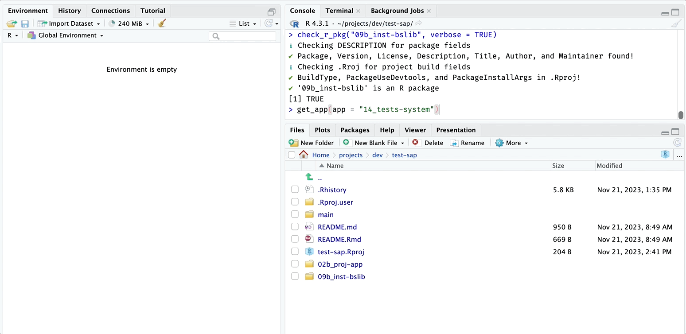

```{r, include = FALSE}
knitr::opts_chunk$set(
  collapse = TRUE,
  comment = "#>"
)
```

```{r setup}
library(shinypak)
```

**`shinypak` assumes you have GitHub and Posit workbench synced. Read more about setting this up on the [`gert` package website](https://docs.ropensci.org/gert/#automatic-authentication)**

> "*In `gert`, authentication is done automatically using the [`credentials` package](https://docs.ropensci.org/credentials/articles/intro.html). This package calls out to the local OS credential store which is also used by the git command line. Therefore gert will automatically pick up on https credentials that are safely stored in your OS keychain.*"


## List all apps 

The apps are stored in branches on the `sap` repo. 

```{r}
list_apps() |> head()
```

You can also specify a `regex` to return a table of branches matching a particular chapter or topic: 

```{r}
list_apps("^16")
```


```{r}
list_apps("tests")
```

# Launch

To launch an app from the [Shiny App-Packages book](https://mjfrigaard.github.io/shiny-app-pkgs/), you can supply the name of the branch to `launch()`:

```{r , eval=FALSE}
launch(app = "<branch>")
```

For example, we'll start with one of the branches from the [early chapters of Shiny App-Packages](https://mjfrigaard.github.io/shiny-app-pkgs/shiny.html#sec-shiny-folders) (the app is not quite an app-package yet):

```{r , eval=FALSE}
launch(app = "02.3_proj-app")
```

`launch()` will check if the application has already been downloaded, download the application files into a folder in the current working directory, then launch the app:

``` bash
✔ '02.3_proj-app' not in local working directory [59ms]
✔ downloading '02.3_proj-app' [10.7s] 
✔ got '02.3_proj-app' [163ms]         
✔ Launching app with: shiny::shinyAppDir('02.3_proj-app/app.R') 
```

If the branch is storing an app-package, `launch()` loads the package and then launches the application:

```{r launch, echo=FALSE, out.width='100%', fig.align='center'}
knitr::include_graphics("../man/figures/launch_readme.gif")
```


## Helper

The `is_r_package()` function is useful for determining if a directory contains an R package. If `path` contains a folder that isn't an R package, it will return `FALSE`.

```{r , eval=TRUE}
is_r_package(path = system.file("pkg", package = "shinypak"))
```

If the `verbose` argument is set to `TRUE`, the details are printed on what is being checked: 

```{r , eval=TRUE}
is_r_package(path = system.file("pkg", package = "shinypak"), verbose = TRUE)
```


## Get

`launch()` calls the `get_app()` function. If you call `get_app()`, the specified branch and application will be downloaded into the current working directory:

```{r , eval=FALSE}
get_app(app = "14_tests-system")
```

```{r get_app, echo=FALSE, out.width='100%', fig.align='center'}

```

You can open the new app project by supplying the `open = TRUE` argument:

```{r , eval=FALSE}
get_app(app = "14_tests-system", open = TRUE)
```

```{r get_app_open, echo=FALSE, out.width='100%', fig.align='center'}
knitr::include_graphics("../man/figures/get_app_open.gif")
```

If the app is already downloaded, the files are updated with the latest commit to the branch. 

## Lookup Table 

`topic_lookup` connects `branch`, `part`, and `chapter`:

```{r topic_lookup, eval=FALSE}
topic_lookup
```

```{r, echo=FALSE}
knitr::kable(topic_lookup)
```
