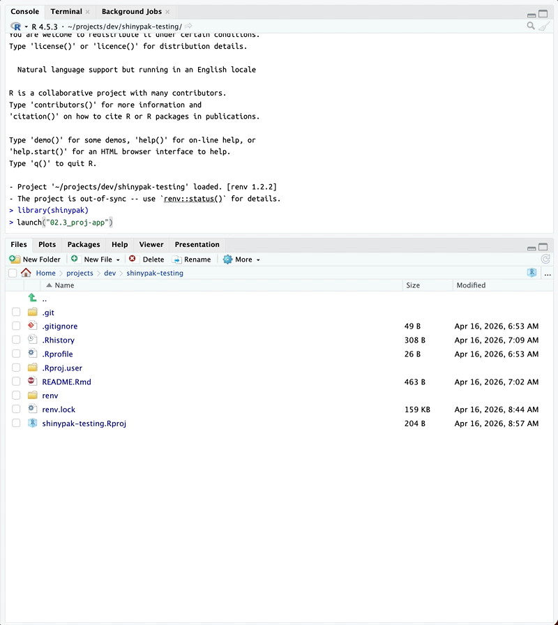

```{r setup, include = FALSE}
knitr::opts_chunk$set(
  collapse = TRUE,
  comment = "#>"
)
```

`shinypak` is a supplemental package for the [Shiny App-Packages book](https://mjfrigaard.github.io/shiny-app-pkgs/). It's functions are designed to give readers of the book quick and easy access to the app-packages so they can follow along.


## Authentication

`shinypak` assumes you have GitHub and RStudio (or Positron) synced. Read more about setting this up on the [`gert` package website](https://docs.ropensci.org/gert/#automatic-authentication)

> "*In `gert`, authentication is done automatically using the [`credentials` package](https://docs.ropensci.org/credentials/articles/intro.html). This package calls out to the local OS credential store which is also used by the git command line. Therefore `gert` will automatically pick up on https credentials that are safely stored in your OS keychain.*"


## Workflow

After authenticating with GitHub, a typical workflow with `shinypak` would be: 

1. Install and load the package

```{r eval=FALSE}
install.packages('pak')
pak::pak("mjfrigaard/shinypak", force = TRUE)
```


```{r pkg}
library(shinypak)
```

2. Find an example application in a chapter to follow along with (we'll use `02.3_proj-app`). 

3. Find the application in the look-up table with `list_apps()`. You can specify a `regex` to return a table of branches matching a particular chapter or topic: 

```{r}
list_apps(regex = "^02.3") 
```

```{r}
list_apps(regex = "proj-app") 
```

4. To launch an app from the [Shiny App-Packages book](https://mjfrigaard.github.io/shiny-app-pkgs/), you can supply the name of the branch to `launch()`:

```{r , eval=FALSE}
launch(app = "<branch>")
```
  - For example, The `02.3_proj-app` branch is from the [early chapters of Shiny App-Packages](https://mjfrigaard.github.io/shiny-app-pkgs/shiny.html#sec-shiny-folders) (i.e., the app is not quite an app-package yet):

```{r , eval=FALSE}
launch(app = "02.3_proj-app")
```

  - `launch()` will check if the application has already been downloaded, download the application files into a folder in the current working directory, then launch the app:

    ``` bash
    ✔ '02.3_proj-app' not in local working directory [59ms]
    ✔ downloading '02.3_proj-app' [10.7s] 
    ✔ got '02.3_proj-app' [163ms]         
    ✔ Launching app with: shiny::shinyAppDir('02.3_proj-app/app.R') 
    ```

  - If the branch is storing an app-package, `launch()` loads the package and then launches the application:

```{r launch, echo=FALSE, out.width='100%', fig.align='center'}

```

5. If you'd prefer to download the application without launching it, you can call the `get_app()` function and the specified branch and application will be downloaded into the current working directory:

```{r , eval=FALSE}
get_app(app = "05_roxygen2")
```

```{r get_app, echo=FALSE, out.width='100%', fig.align='center'}
knitr::include_graphics("../man/figures/get_app.gif")
```

  - You can open the new app project by supplying the `open = TRUE` argument:

```{r , eval=FALSE}
get_app(app = "05_roxygen2", open = TRUE)
```

```{r get_app_open, echo=FALSE, out.width='100%', fig.align='center'}
knitr::include_graphics("../man/figures/get_app_open.gif")
```

  - If the app is already downloaded, the files are updated with the latest commit to the branch. 

## Helper

The `is_r_package()` function is useful for determining if a directory contains an R package. Consider the three folders below: 

```{verbatim}
path/to/pkg
├── DESCRIPTION
└── pkg.Rproj
```

```{verbatim}
path/to/app
├── DESCRIPTION
└── app.Rproj
```

```{verbatim}
path/to/project
└── project.Rproj
```

If the folder contains an R package, `is_r_package()` returns `TRUE`.

```{r , eval=TRUE}
is_r_package(path = system.file("pkg", package = "shinypak"))
```

If the `verbose` argument is set to `TRUE`, the details are printed on what is being checked: 

```{r , eval=TRUE}
is_r_package(
  path = system.file("pkg", package = "shinypak"), 
  verbose = TRUE)
```

This can be used to quickly determine if a folder contains an R package or Shiny app (and what is missing). Consider the `app` folder (with a `DESCRIPTION` and `.Rproj` file).

```{r}
is_r_package(
    path = system.file("app", package = "shinypak"), 
    verbose = TRUE)
```

This tells is `app` has fields missing from the `DESCRIPTION` and the `.Rproj` isn't configured with RStudio's build tools.

## Lookup Table 

`topic_lookup` connects `branch`, `part`, and `chapter`:

```{r topic_lookup, eval=FALSE}
topic_lookup
```

```{r, echo=FALSE}
knitr::kable(topic_lookup)
```
