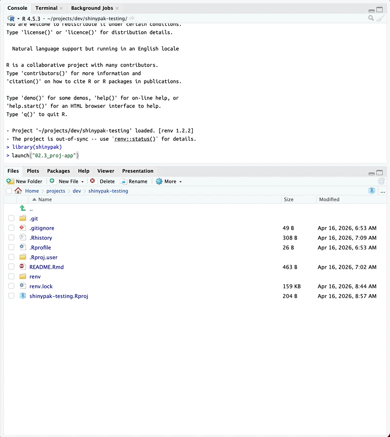
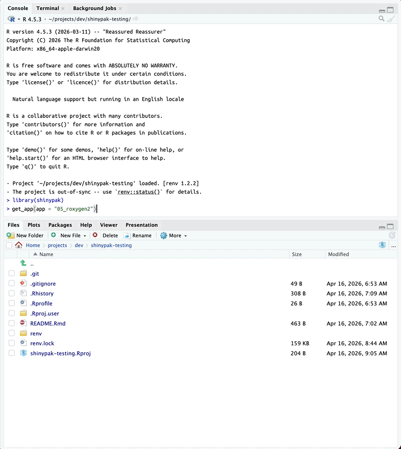

```{r setup, include = FALSE}
knitr::opts_chunk$set(
  collapse = TRUE,
  comment = "#>"
)
```

Each chapter in the [Shiny App-Packages book](https://mjfrigaard.github.io/shiny-app-pkgs/) has a matching Shiny application, and each of those applications lives on its own branch of the [`sap`](https://github.com/mjfrigaard/sap) repository. Cloning branches by hand gets tedious after the second or third chapter, so `shinypak` handles it for you. This vignette covers authenticating with GitHub, finding an app, launching or downloading it, and using `is_r_package()` to check what a folder actually contains.

## Authentication

`shinypak` assumes you have GitHub and RStudio (or Positron) synced. You can read more about setting this up on the [`gert` package website](https://docs.ropensci.org/gert/#automatic-authentication):

> "*In `gert`, authentication is done automatically using the [`credentials` package](https://docs.ropensci.org/credentials/articles/intro.html). This package calls out to the local OS credential store which is also used by the git command line. Therefore `gert` will automatically pick up on https credentials that are safely stored in your OS keychain.*"


## Workflow

After authenticating with GitHub, a typical workflow with `shinypak` would be: 

1. Install and load the package

```{r eval=FALSE}
install.packages('pak')
pak::pak("mjfrigaard/shinypak", force = TRUE)
```


```{r pkg}
library(shinypak)
```

2. Find an example application in a chapter to follow along with (we'll use `02.3_proj-app`). 

3. Confirm the branch name with `list_apps()`. Supplying a `regex` returns only the branches matching a particular chapter or topic:

```{r}
list_apps(regex = "^02.3") 
```

```{r}
list_apps(regex = "proj-app") 
```

4. To launch an app from the [Shiny App-Packages book](https://mjfrigaard.github.io/shiny-app-pkgs/), you can supply the name of the branch to `launch()`:

```{r , eval=FALSE}
launch(app = "<branch>")
```
  - For example, the `02.3_proj-app` branch comes from the [early chapters of Shiny App-Packages](https://mjfrigaard.github.io/shiny-app-pkgs/shiny.html#sec-shiny-folders), so the app isn't quite an app-package yet:

```{r , eval=FALSE}
launch(app = "02.3_proj-app")
```

  - `launch()` will check if the application has already been downloaded, download the application files into a folder in the current working directory, then launch the app:

    ``` bash
    ✔ '02.3_proj-app' not in local working directory [59ms]
    ✔ downloading '02.3_proj-app' [10.7s] 
    ✔ got '02.3_proj-app' [163ms]         
    ✔ Launching app with: shiny::shinyAppDir('02.3_proj-app/app.R') 
    ```

  - If the branch is storing an app-package, `launch()` loads the package and then launches the application:

```{r launch, echo=FALSE, out.width='100%', fig.align='center'}

```

5. If you'd prefer to download the application without launching it, call `get_app()`. The branch is downloaded into your current working directory:

```{r , eval=FALSE}
get_app(app = "05_roxygen2")
```

```{r get_app, echo=FALSE, out.width='100%', fig.align='center'}

```

  - Supply `open = TRUE` to open the new project in a fresh IDE session:

```{r , eval=FALSE}
get_app(app = "05_roxygen2", open = TRUE)
```

```{r get_app_open, echo=FALSE, out.width='100%', fig.align='center'}
knitr::include_graphics("../man/figures/get_app_open.gif")
```

  - If the app is already downloaded, the files are updated with the latest commit to the branch.

## Helper functions

Not every folder with a `DESCRIPTION` file is an R package, and not every `.Rproj` file is configured for package development. `is_r_package()` checks both. Consider the three folders below:

```{verbatim}
path/to/pkg
├── DESCRIPTION
└── pkg.Rproj
```

```{verbatim}
path/to/app
├── DESCRIPTION
└── app.Rproj
```

```{verbatim}
path/to/project
└── project.Rproj
```

If the folder contains an R package, `is_r_package()` returns `TRUE`.

```{r , eval=TRUE}
is_r_package(path = system.file("pkg", package = "shinypak"))
```

Setting `verbose = TRUE` prints the details of each check:

```{r , eval=TRUE}
is_r_package(
  path = system.file("pkg", package = "shinypak"), 
  verbose = TRUE)
```

The verbose output tells you what's missing, not just whether the check failed. Consider the `app` folder, which has both a `DESCRIPTION` and an `.Rproj` file:

```{r}
is_r_package(
    path = system.file("app", package = "shinypak"), 
    verbose = TRUE)
```

This tells us `app` is missing fields from its `DESCRIPTION`, and its `.Rproj` file isn't configured with RStudio's build tools.

## Lookup table

`topic_lookup` connects each `branch` to its `part` and `chapter` in the book:

```{r topic_lookup, eval=FALSE}
topic_lookup
```

```{r, echo=FALSE}
knitr::kable(topic_lookup)
```

## Recap

The workflow is three functions: `list_apps()` to find the branch you want, `launch()` to run it, and `get_app()` to download it without running it. `is_r_package()` is there for when you want to confirm whether a folder is a package, an app, or just a project.

The source for every application is on a branch of the [`sap` repository](https://github.com/mjfrigaard/sap/branches/all), and each branch maps back to a chapter in [Shiny App-Packages](https://mjfrigaard.github.io/shiny-app-pkgs/).
